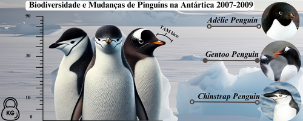

# Explorando a Biodiversidade de Pinguins na Antártica: Análise das Características Físicas e Mudanças de 2007 a 2009


<p align="center">
    
</p>
        
Este projeto visa explorar e analisar as características físicas de três espécies de pinguins da região de Palmer (Chinstrap, Gentoo, Adélie), na Antártica, utilizando o conjunto de dados "palmerpenguins". O foco está em examinar variáveis como comprimento e profundidade do bico, comprimento da nadadeira, massa corporal, além de aspectos geográficos e temporais, como a ilha de origem e o ano de observação. A análise busca identificar padrões físicos entre as espécies, explorar relações entre as variáveis, e investigar possíveis mudanças nas características dos pinguins entre os anos de 2007 a 2009.


## Desenvolvedora
 - Halane Moreira -> https://github.com/HalaneMoreira
 
## Justificativa
Estudos sobre a fauna polar, incluindo pinguins, são essenciais para entender o impacto das mudanças climáticas e das atividades humanas em ecossistemas sensíveis. A análise das características físicas dos pinguins ao longo dos anos pode revelar informações importantes sobre adaptações biológicas e a saúde das populações de pinguins em resposta a mudanças ambientais. Este projeto busca não apenas caracterizar as espécies, mas também contribuir para a compreensão das possíveis transformações no habitat antártico, informando estratégias de preservação e fornecendo dados relevantes para futuras pesquisas ambientais e biológicas.


## Metodologia
O projeto será desenvolvido utilizando a metodologia CRISP-DM, seguindo os seguintes passos:

1. Entendimento de negócio
2. Entendimento de dados
3. Preparação dos dados
4. Modelagem
O projeto também é dividido em duas entregas, a saber:

1. Análise Exploratória de Dados (EDA): entendimento das variáveis que influenciam o MPG e identificação de padrões nos dados através de hipóteses, visualizações e insights.
2. Análise comparativa de modelos: construção de modelos de aprendizado de máquina para rpevisão de consumo, com métricas de desempenho para avaliação da performance.

## Resultados Esperados

Esperamos identificar diferenças nas características físicas dos pinguins dependendo da ilha de origem (Biscoe, Dream, Torgersen). Essas diferenças podem revelar como as condições geográficas influenciam as adaptações físicas das diferentes espécies. Podendo incluir aumento ou diminuição no tamanho médio das variáveis (como massa corporal ou comprimento de nadadeiras), refletindo possíveis efeitos ambientais.

## Tecnologias Utilizadas

<div align="center" style="display: inline_block">


</div>

## Organização de Diretórios

```
.
├── data/              # Diretório contendo todos os arquivos de dados
│   ├── external/      # Arquivos de dados de fontes externas
│   ├── interim/       # Arquivos de dados intermediários
│   ├── processed/     # Arquivos de dados processados
│   └── raw/           # Arquivos de dados originais, imutáveis
├── docs/              # Documentação gerada através da biblioteca mkdocs
├── models/            # Modelos treinados e serializados, predições ou resumos de modelos
├── notebooks/         # Diretório contendo todos os notebooks utilizados nos passos
├── references/        # Dicionários de dados, manuais e todo o material exploratório
├── src/               # Código fonte utilizado nesse projeto
│   ├── data/          # Classes e funções utilizadas para download e processamento de dados
│   ├── deployment/    # Classes e funções utilizadas para implantação do modelo
│   └── model/         # Classes e funções utilizadas para modelagem
├── app.py             # Arquivo com o código da aplicação do streamlit
├── Procfile           # Arquivo de configuração do heroku
├── pyproject.toml     # Arquivo de dependências para reprodução do projeto
├── poetry.lock        # Arquivo com sub-dependências do projeto principal
├── README.md          # Informações gerais do projeto
└── tasks.py           # Arquivo com funções para criação de tarefas utilizadas pelo invoke

```
